# AI Writing Assistant - Data Flow Diagrams

## Document Information
- **Created**: 2025-12-27
- **Asana Task**: https://app.asana.com/0/1211710875848660/1212598914422287
- **Related**: AI_WRITING_ASSISTANT_INTEGRATION.md

## Overview

This document provides detailed data flow diagrams for the AI Writing Assistant integration, showing how data moves through the system from user interaction to AI response.

---

## 1. High-Level System Data Flow

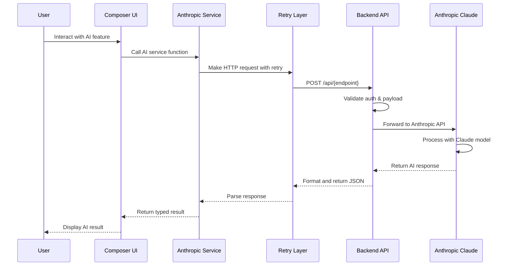

---

## 2. Tone Adjustment Flow

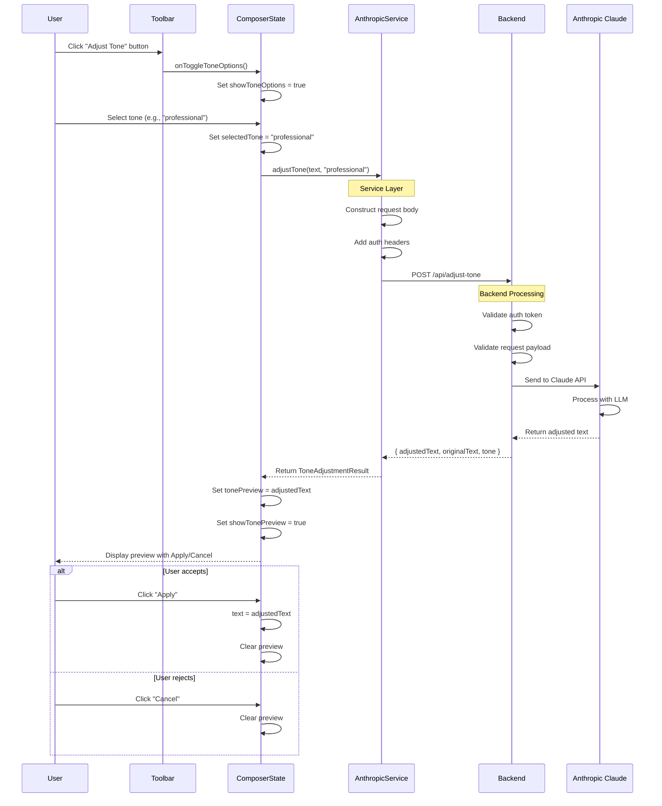

---

## 3. Alt Text Generation Flow

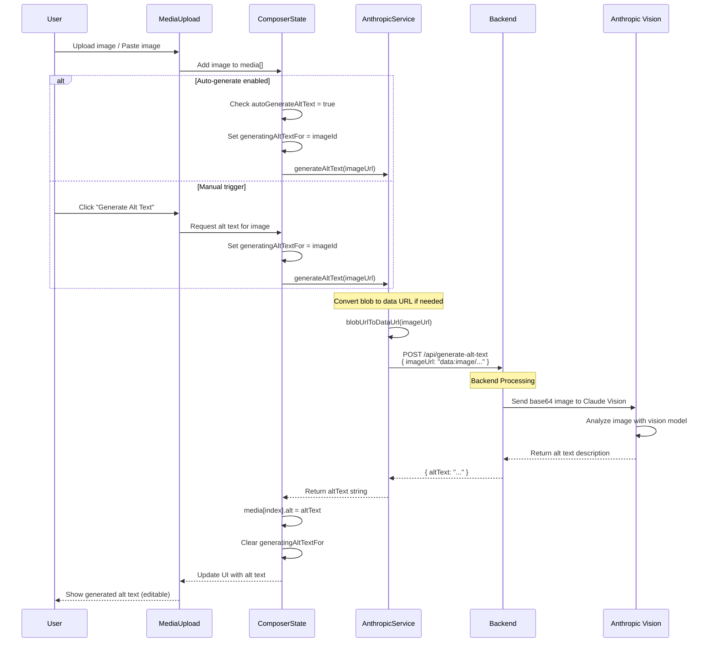

---

## 4. Writing Feedback Flow

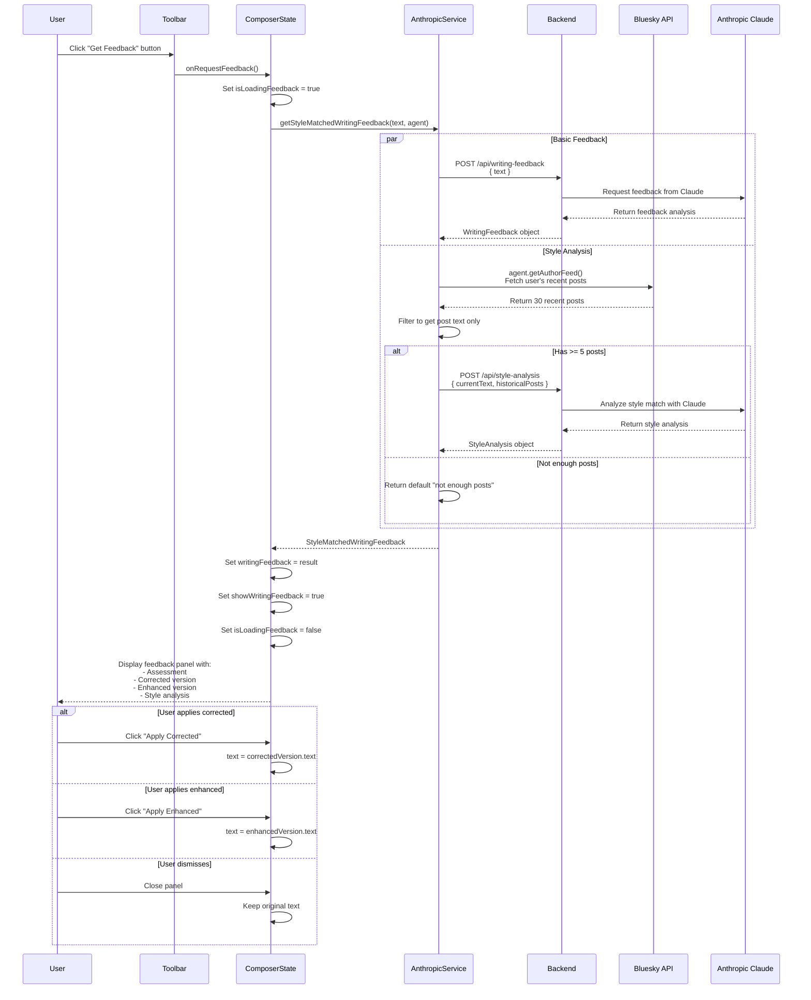

---

## 5. Thread Optimization Flow

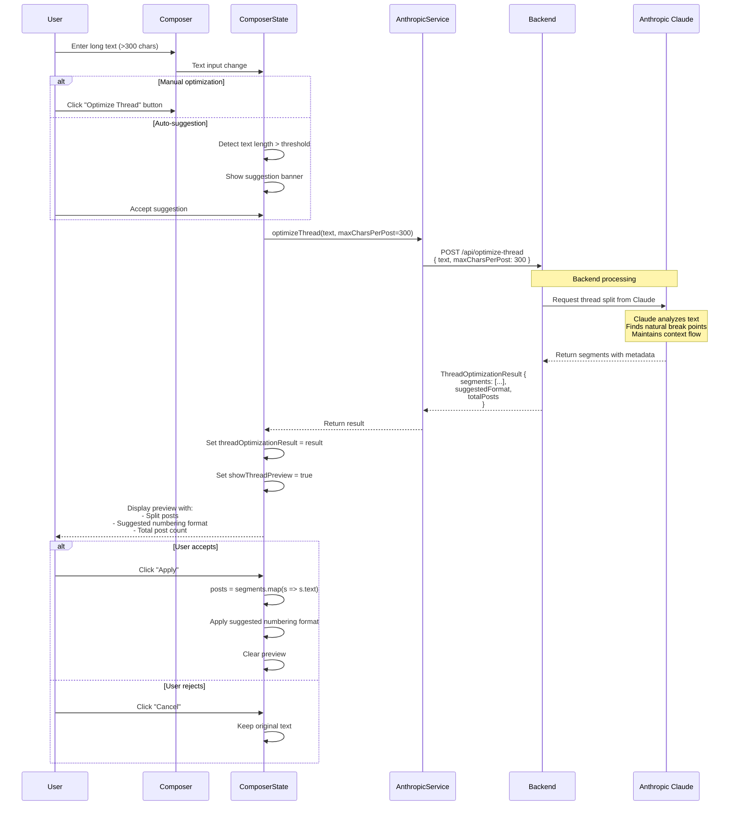

---

## 6. Error Handling Flow

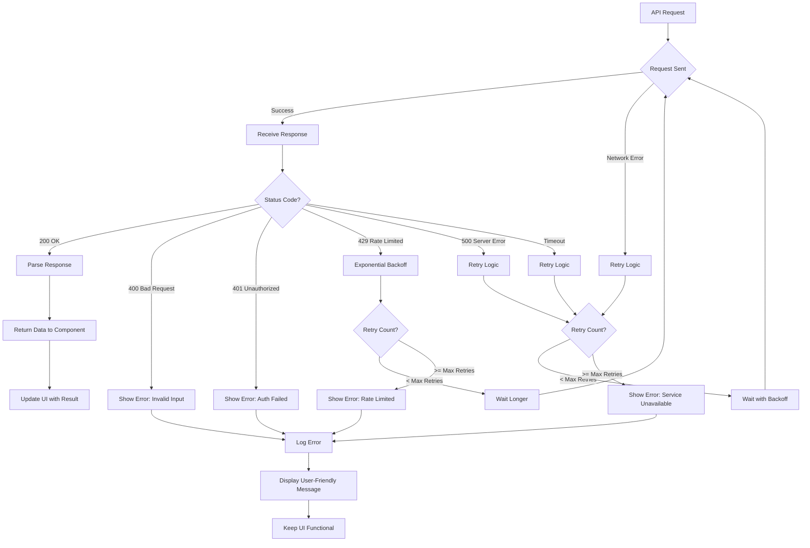

---

## 7. Authentication & Security Flow

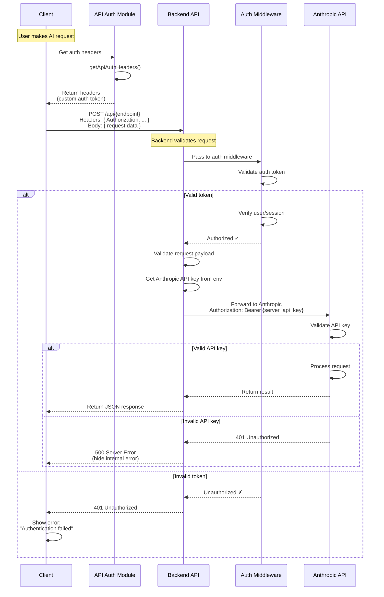

---

## 8. Caching Strategy Flow

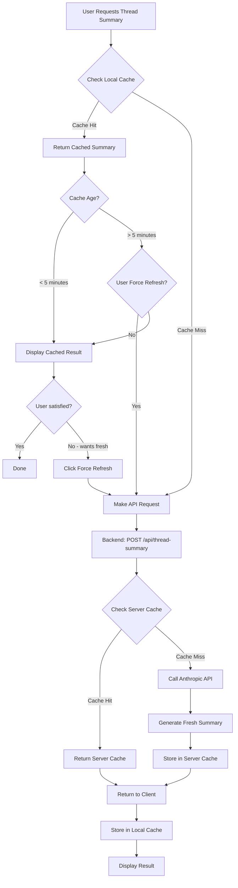

---

## 9. Progressive Disclosure UI Flow

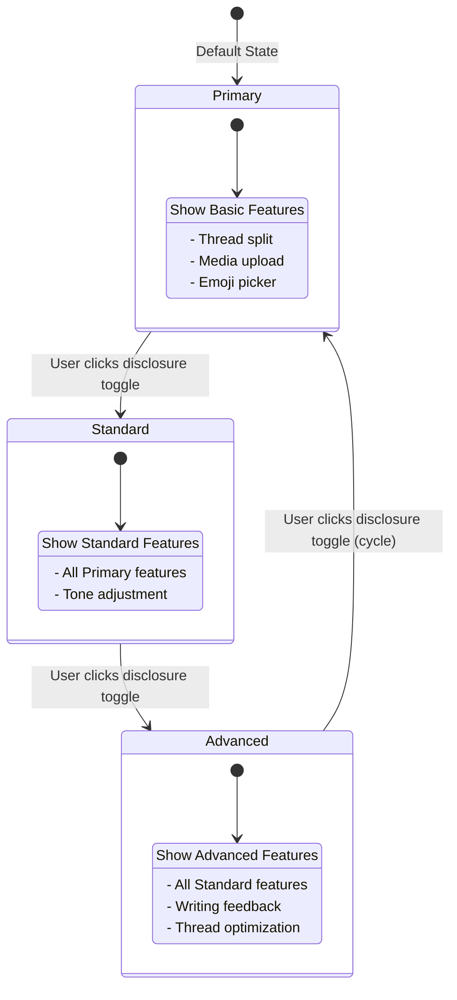

---

## 10. Data Privacy Flow

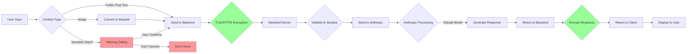

---

## 11. Rate Limiting Flow

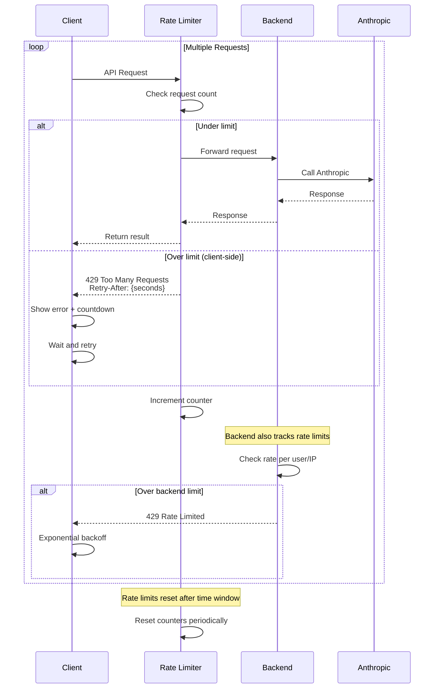

---

## 12. Complete Request Lifecycle

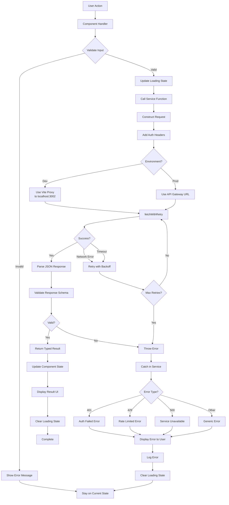

---

## Notes

### Diagram Rendering

These diagrams use Mermaid syntax and can be rendered in:
- GitHub (natively supports Mermaid)
- GitLab (natively supports Mermaid)
- VS Code (with Mermaid preview extension)
- Documentation sites (Docusaurus, VuePress, etc.)
- Mermaid Live Editor: https://mermaid.live

### Key Takeaways

1. **Async Nature**: All AI operations are asynchronous with loading states
2. **Error Resilience**: Multiple retry layers and graceful degradation
3. **Security**: Multi-layer authentication, no client-side API keys
4. **User Experience**: Clear feedback at each stage, cancellable operations
5. **Performance**: Caching, progressive disclosure, smart retry logic

### Related Documentation

- Architecture Overview: `AI_WRITING_ASSISTANT_INTEGRATION.md`
- Retry Logic Details: `docs/RETRY_LOGIC.md`
- AT Protocol Integration: `docs/atproto-validation-and-rate-limiting.md`

---

**Last Updated**: 2025-12-27
