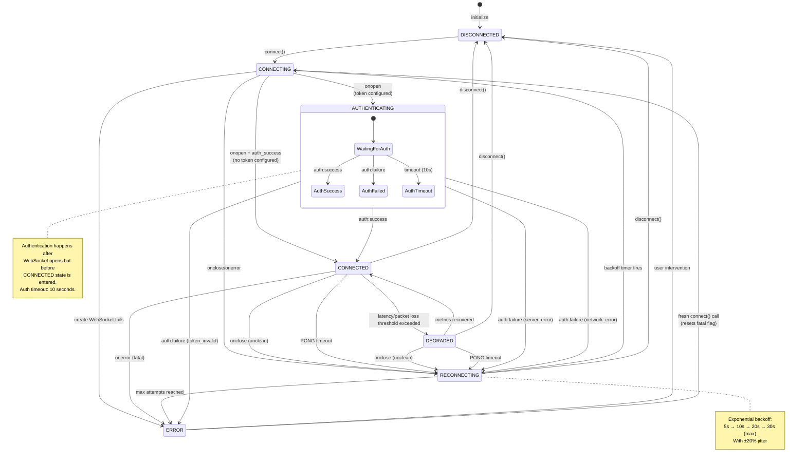
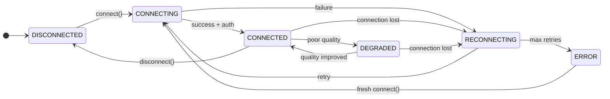

# WebSocket Connection State Machine

This document provides formal documentation of the WebSocket state machine including states, transitions, triggers, and race condition handling.

## Table of Contents

1. [Overview](#overview)
2. [Connection States](#connection-states)
3. [State Diagram](#state-diagram)
4. [State Transition Table](#state-transition-table)
5. [Transition Details](#transition-details)
6. [Race Condition Handling](#race-condition-handling)
7. [Testing Scenarios](#testing-scenarios)
8. [Architecture Decision Record](#architecture-decision-record)
9. [Code Reference](#code-reference)

---

## Overview

The WebSocket service implements a finite state machine to manage connection lifecycle. The state machine handles connection establishment, authentication, heartbeat monitoring, reconnection with exponential backoff, and graceful degradation.

### Key Design Principles

- **Explicit States**: Every connection condition is represented by a distinct state
- **Guard Conditions**: Transitions are protected by boolean guards to prevent invalid state changes
- **Idempotent Operations**: Multiple calls to `connect()` or `disconnect()` are safe
- **Fail-Safe Defaults**: Unknown conditions default to reconnection with backoff

### Files Involved

| File                                | Purpose                           |
| ----------------------------------- | --------------------------------- |
| `src/services/websocket-service.ts` | Core state machine implementation |
| `src/types/websocket.ts`            | State enum and type definitions   |
| `src/config/websocket.config.ts`    | Timing constants and thresholds   |

---

## Connection States

The WebSocket service defines six connection states:

### DISCONNECTED

**Description**: No active connection. The service is idle and ready to connect.

| Property           | Value                             |
| ------------------ | --------------------------------- |
| WebSocket instance | `null` or `readyState === CLOSED` |
| isAuthenticated    | `false`                           |
| Entry actions      | Clear all timers, update metrics  |
| Exit actions       | None                              |

**Entered from**: Initial state, CONNECTED (on clean close), RECONNECTING (on max attempts), ERROR (after fatal error)

### CONNECTING

**Description**: Establishing TCP/WebSocket connection. Waiting for `onopen` event.

| Property           | Value                                |
| ------------------ | ------------------------------------ |
| WebSocket instance | Created, `readyState === CONNECTING` |
| isAuthenticated    | `false`                              |
| Entry actions      | Create WebSocket, setup listeners    |
| Exit actions       | None                                 |

**Duration**: Typically < 5 seconds (depends on network)

### CONNECTED

**Description**: Fully operational connection. Authentication complete, heartbeat active.

| Property           | Value                                 |
| ------------------ | ------------------------------------- |
| WebSocket instance | `readyState === OPEN`                 |
| isAuthenticated    | `true`                                |
| Entry actions      | Start heartbeat timer, update metrics |
| Exit actions       | Stop heartbeat timer                  |

**Key behaviors**:

- Sends PING every 30 seconds (configurable via `HEARTBEAT_INTERVAL_MS`)
- Expects PONG within 10 seconds (configurable via `PONG_TIMEOUT_MS`)
- Tracks latency from PING/PONG round-trip time

### DEGRADED

**Description**: Connection is open but experiencing performance issues.

| Property           | Value                  |
| ------------------ | ---------------------- |
| WebSocket instance | `readyState === OPEN`  |
| isAuthenticated    | `true`                 |
| Entry actions      | Log degradation reason |
| Exit actions       | None                   |

**Triggers for entering DEGRADED**:

- P95 latency > 5000ms (`P95_LATENCY_THRESHOLD_MS`)
- Packet loss > 10% (`PACKET_LOSS_THRESHOLD_PERCENT`)

**Recovery**: Automatically transitions back to CONNECTED when metrics improve.

### RECONNECTING

**Description**: Attempting to re-establish a lost connection.

| Property           | Value                                                |
| ------------------ | ---------------------------------------------------- |
| WebSocket instance | `null` (old connection closed)                       |
| isAuthenticated    | `false`                                              |
| Entry actions      | Increment reconnect counter, calculate backoff delay |
| Exit actions       | Cancel reconnect timer if transitioning out          |

**Reconnection behavior**:

- Exponential backoff: `baseDelay * 2^(attempt-1)`
- Base delay: 5000ms, max delay: 30000ms
- Jitter: ±20% to prevent thundering herd
- Max attempts: 10 (configurable, unlimited for network errors)

### ERROR

**Description**: Terminal error state. Connection cannot be recovered without intervention.

| Property           | Value                                       |
| ------------------ | ------------------------------------------- |
| WebSocket instance | `null` or `readyState === CLOSED`           |
| isAuthenticated    | `false`                                     |
| isAuthFatalError   | `true` (for token errors)                   |
| Entry actions      | Log error, emit ERROR event                 |
| Exit actions       | Clear fatal error flag on fresh `connect()` |

**Enters ERROR state when**:

- Max reconnection attempts exceeded
- Authentication fails with invalid/expired token
- Unrecoverable protocol error

---

## State Diagram



### Simplified View



---

## State Transition Table

### Valid Transitions

| From State   | To State     | Trigger                      | Guard Condition                                | Action                                                           |
| ------------ | ------------ | ---------------------------- | ---------------------------------------------- | ---------------------------------------------------------------- |
| DISCONNECTED | CONNECTING   | `connect()`                  | Not already connecting                         | Create WebSocket, setup listeners                                |
| CONNECTING   | CONNECTED    | `onopen`                     | No token configured                            | Start heartbeat, emit CONNECT                                    |
| CONNECTING   | (auth flow)  | `onopen`                     | Token configured                               | Send auth message, start auth timeout                            |
| (auth flow)  | CONNECTED    | `auth:success`               | -                                              | Clear auth timeout, start heartbeat, emit AUTH_SUCCESS + CONNECT |
| (auth flow)  | ERROR        | `auth:failure`               | Category = TOKEN_INVALID                       | Set isAuthFatalError, emit AUTH_EXPIRED, close connection        |
| (auth flow)  | RECONNECTING | `auth:failure`               | Category = SERVER_ERROR                        | Close connection, schedule reconnect with max attempts           |
| (auth flow)  | RECONNECTING | `auth:failure`               | Category = NETWORK_ERROR                       | Close connection, schedule reconnect (unlimited)                 |
| (auth flow)  | RECONNECTING | auth timeout                 | -                                              | Close connection, schedule reconnect                             |
| CONNECTING   | RECONNECTING | `onerror` or `onclose`       | Not intentionally closed                       | Schedule reconnect                                               |
| CONNECTING   | ERROR        | WebSocket constructor throws | -                                              | Log error, schedule reconnect                                    |
| CONNECTED    | DISCONNECTED | `disconnect()`               | -                                              | Clear timers, close with code 1000                               |
| CONNECTED    | RECONNECTING | `onclose`                    | wasClean = false                               | Clear timers, schedule reconnect                                 |
| CONNECTED    | RECONNECTING | PONG timeout                 | -                                              | Close with code 4002, schedule reconnect                         |
| CONNECTED    | DEGRADED     | latency/loss threshold       | P95 > 5s OR loss > 10%                         | Log degradation reason                                           |
| CONNECTED    | ERROR        | `onerror`                    | Fatal error                                    | Emit ERROR event                                                 |
| DEGRADED     | CONNECTED    | metrics recovered            | P95 ≤ 5s AND loss ≤ 10%                        | Log recovery                                                     |
| DEGRADED     | DISCONNECTED | `disconnect()`               | -                                              | Clear timers, close with code 1000                               |
| DEGRADED     | RECONNECTING | `onclose` or PONG timeout    | -                                              | Same as CONNECTED                                                |
| RECONNECTING | CONNECTING   | backoff timer                | Not intentionally closed, not fatal auth error | Increment counter, emit RECONNECT, call connect()                |
| RECONNECTING | ERROR        | max attempts reached         | reconnectAttempts ≥ maxReconnectAttempts       | Set lastError, stop reconnecting                                 |
| RECONNECTING | DISCONNECTED | `disconnect()`               | -                                              | Clear reconnect timer                                            |
| ERROR        | CONNECTING   | `connect()`                  | reconnectAttempts = 0                          | Reset isAuthFatalError, proceed with connection                  |

### Invalid Transitions (Guarded)

| From State | Attempted Transition | Guard That Prevents                                             |
| ---------- | -------------------- | --------------------------------------------------------------- |
| CONNECTING | CONNECTING           | `readyState === CONNECTING` or `connectionState === CONNECTING` |
| CONNECTED  | CONNECTING           | `readyState === OPEN`                                           |
| Any        | RECONNECTING         | `isIntentionallyClosed === true`                                |
| Any        | RECONNECTING         | `isAuthFatalError === true`                                     |

---

## Transition Details

### Connection Establishment Flow

```
User calls connect()
    │
    ├── Guard: Already OPEN? → Return (no-op)
    ├── Guard: Already CONNECTING? → Return (no-op)
    │
    ▼
Set isIntentionallyClosed = false
Set isAuthenticated = false
Reset isAuthFatalError (if reconnectAttempts = 0)
    │
    ▼
Update state → CONNECTING
Create new WebSocket(url)
Setup event listeners
    │
    ├── onopen fires
    │       │
    │       ├── Token configured?
    │       │       │
    │       │       ├── YES: Send auth message, start auth timeout
    │       │       │
    │       │       └── NO: Set isAuthenticated = true
    │       │               Update state → CONNECTED
    │       │               Start heartbeat
    │       │               Emit CONNECT event
    │       │
    │       └── Wait for auth response...
    │
    ├── onclose fires (before auth) → Schedule reconnect
    │
    └── onerror fires → Log error, (onclose will follow)
```

### Authentication Flow

```
onopen received (with token configured)
    │
    ▼
Send { type: "auth", token: "..." }
Start auth timeout (10 seconds)
    │
    ├── auth:success received
    │       │
    │       ▼
    │   Clear auth timeout
    │   Set isAuthenticated = true
    │   Update state → CONNECTED
    │   Start heartbeat
    │   Emit AUTH_SUCCESS
    │   Emit CONNECT
    │
    ├── auth:failure received
    │       │
    │       ▼
    │   Clear auth timeout
    │   Set isAuthenticated = false
    │   Categorize error:
    │       │
    │       ├── TOKEN_INVALID (401, 403, "expired", etc.)
    │       │       │
    │       │       ▼
    │       │   Set isAuthFatalError = true
    │       │   Emit AUTH_EXPIRED
    │       │   Close(4001)
    │       │   Update state → ERROR
    │       │   DO NOT schedule reconnect
    │       │
    │       ├── SERVER_ERROR (5xx, "service unavailable")
    │       │       │
    │       │       ▼
    │       │   Close(4001)
    │       │   Update state → ERROR
    │       │   Schedule reconnect (with max attempts)
    │       │
    │       └── NETWORK_ERROR (timeout, DNS, connection refused)
    │               │
    │               ▼
    │           Close(4001)
    │           Update state → ERROR
    │           Schedule reconnect (unlimited attempts)
    │
    └── Auth timeout fires
            │
            ▼
        handleAuthFailure("Authentication timeout - no response received")
        → Treated as SERVER_ERROR category
```

### Heartbeat/PONG Timeout Flow

```
Heartbeat timer fires (every 30s)
    │
    ├── Guard: isConnected()? → NO: Skip this heartbeat
    │
    ▼
Record lastPingTime = Date.now()
Send { type: "ping", timestamp: "..." }
Start PONG timeout (10 seconds)
    │
    ├── PONG received before timeout
    │       │
    │       ▼
    │   Clear PONG timeout
    │   Calculate latency = now - lastPingTime
    │   Update latencyHistory (max 100 samples)
    │   Update averageLatency
    │   Increment totalPingPongExchanges
    │   Check degraded state:
    │       │
    │       ├── P95 > 5000ms OR packetLoss > 10%?
    │       │       │
    │       │       └── Update state → DEGRADED (if was CONNECTED)
    │       │
    │       └── Metrics OK?
    │               │
    │               └── Update state → CONNECTED (if was DEGRADED)
    │
    └── PONG timeout fires
            │
            ▼
        Log "PONG timeout - server unresponsive"
        Increment pongTimeoutCount
        Increment totalPingPongExchanges
        Close(4002, "PONG timeout")
        Schedule reconnect
```

### Reconnection Flow

```
scheduleReconnect(unlimitedRetries = false)
    │
    ├── Guard: isIntentionallyClosed? → Return (no-op)
    ├── Guard: isAuthFatalError? → Return (no-op)
    ├── Guard: !unlimitedRetries && attempts >= max? → Update state → ERROR, Return
    │
    ▼
Update state → RECONNECTING
Increment reconnectAttempts
Increment totalReconnections (metrics)
    │
    ▼
Calculate backoff delay:
    delay = min(baseDelay * 2^(attempt-1), maxDelay)
    jitter = delay * (0.8 + random * 0.4)
    │
    ▼
Schedule reconnect timer(delay)
    │
    └── Timer fires
            │
            ▼
        Emit RECONNECT event
        Call connect()
```

---

## Race Condition Handling

### 1. Multiple `connect()` Calls

**Scenario**: User rapidly clicks "Connect" button or code calls `connect()` multiple times.

**Resolution**:

```typescript
// websocket-service.ts:112-125
public connect(): void {
  // Guard 1: Already fully connected
  if (this.ws?.readyState === WebSocket.OPEN) {
    this.log("Already connected");
    return;
  }

  // Guard 2: Connection already in progress
  if (
    this.ws?.readyState === WebSocket.CONNECTING ||
    this.stats.connectionState === WebSocketConnectionState.CONNECTING
  ) {
    this.log("Connection already in progress");
    return;
  }
  // ... proceed with connection
}
```

**Result**: Only the first call proceeds; subsequent calls are no-ops.

### 2. `disconnect()` During Authentication

**Scenario**: User logs out while authentication handshake is in progress.

**Resolution**:

```typescript
// disconnect() sets isIntentionallyClosed = true
// This prevents scheduleReconnect() from firing

public disconnect(): void {
  this.isIntentionallyClosed = true;  // ← Key flag
  this.clearTimers();  // Clears auth timeout
  if (this.ws) {
    this.ws.close(1000, "Client disconnect");
    this.ws = null;
  }
  this.updateConnectionState(WebSocketConnectionState.DISCONNECTED);
}

// In scheduleReconnect():
private scheduleReconnect(): void {
  if (this.isIntentionallyClosed) {  // ← Check prevents reconnect
    return;
  }
  // ...
}
```

**Result**: Auth timeout and reconnect timers are cleared; no reconnection attempted.

### 3. Message Received During Reconnecting

**Scenario**: Server sends a message just as connection is being re-established.

**Resolution**:

- Messages are only processed when `ws.readyState === OPEN`
- The `handleMessage()` method doesn't check connection state explicitly because browser WebSocket only delivers messages on open connections
- If WebSocket closes during message processing, the next message will fail naturally

**Result**: Messages either succeed (connection open) or are never received (connection closed).

### 4. PONG Received After Timeout

**Scenario**: Server sends PONG after client has already declared timeout.

**Resolution**:

```typescript
private handlePong(): void {
  // Clear timeout (may already be null if timed out)
  if (this.pongTimeoutTimer) {
    clearTimeout(this.pongTimeoutTimer);
    this.pongTimeoutTimer = null;
  }
  // Continue processing even if late - still useful for metrics
  // ...
}

private handlePongTimeout(): void {
  // ...
  this.pongTimeoutTimer = null;  // Clear reference
  // Connection is already closing/reconnecting
}
```

**Result**: Late PONG is processed for metrics but doesn't affect reconnection in progress.

### 5. Auth Response After Auth Timeout

**Scenario**: Server sends `auth:success` after client has already timed out.

**Resolution**:

```typescript
private handleAuthSuccess(): void {
  if (this.authTimeoutTimer) {
    clearTimeout(this.authTimeoutTimer);
    this.authTimeoutTimer = null;
  }
  this.isAuthenticated = true;
  // ... continues with connection setup
}
```

**Result**:

- If received before timeout: Normal success path
- If received after timeout: The old WebSocket is already closed, so this callback won't fire on the new connection attempt

### 6. Concurrent Connection and Disconnection

**Scenario**: `connect()` called immediately after `disconnect()`.

**Resolution**:

```typescript
public connect(): void {
  // ...
  this.isIntentionallyClosed = false;  // Reset on every connect()
  // ...
}

public disconnect(): void {
  this.isIntentionallyClosed = true;
  this.clearTimers();
  // ...
}
```

**Result**: The most recent operation wins. If `disconnect()` is called after `connect()`, the `isIntentionallyClosed` flag prevents reconnection attempts.

### 7. Metrics Update During State Transition

**Scenario**: `updateConnectionState()` called while calculating metrics.

**Resolution**:

```typescript
private updateConnectionState(state: WebSocketConnectionState): void {
  const previousState = this.stats.connectionState;
  const now = Date.now();

  // Atomically update connected time tracking
  if (
    (previousState === CONNECTED || previousState === DEGRADED) &&
    (state !== CONNECTED && state !== DEGRADED)
  ) {
    // Leaving connected state
    this.totalConnectedTime += now - this.lastConnectedTimestamp;
    this.lastDisconnectedTimestamp = now;
    this.lastConnectedTimestamp = null;
  }

  // Update state last
  this.stats.connectionState = state;
}
```

**Result**: Metrics are calculated based on timestamps captured at transition time, avoiding race between state change and metric calculation.

---

## Testing Scenarios

### Unit Test Cases

#### State: DISCONNECTED → CONNECTING

```typescript
describe("DISCONNECTED → CONNECTING", () => {
  it("should transition on connect() call", () => {
    const service = new WebSocketService({ url: "ws://test" });
    expect(service.getConnectionState()).toBe("disconnected");

    service.connect();
    expect(service.getConnectionState()).toBe("connecting");
  });

  it("should not transition if already connecting", () => {
    const service = new WebSocketService({ url: "ws://test" });
    service.connect();

    // Second call should be no-op
    const stateBefore = service.getConnectionState();
    service.connect();
    expect(service.getConnectionState()).toBe(stateBefore);
  });
});
```

#### State: CONNECTING → CONNECTED (with auth)

```typescript
describe("CONNECTING → CONNECTED (with auth)", () => {
  it("should authenticate after WebSocket opens", async () => {
    const service = new WebSocketService({
      url: "ws://test",
      accessToken: "test-token",
    });

    service.connect();
    // Simulate onopen
    mockWs.onopen();

    // Should have sent auth message
    expect(mockWs.send).toHaveBeenCalledWith(
      expect.stringContaining('"type":"auth"'),
    );

    // Simulate auth success
    mockWs.onmessage({ data: JSON.stringify({ type: "auth:success" }) });

    expect(service.getConnectionState()).toBe("connected");
    expect(service.isConnected()).toBe(true);
  });

  it("should handle auth timeout", async () => {
    jest.useFakeTimers();
    const service = new WebSocketService({
      url: "ws://test",
      accessToken: "test-token",
      authTimeout: 1000,
    });

    service.connect();
    mockWs.onopen();

    // Advance past auth timeout
    jest.advanceTimersByTime(1001);

    expect(service.getConnectionState()).toBe("reconnecting");
  });
});
```

#### State: CONNECTED → DEGRADED

```typescript
describe("CONNECTED → DEGRADED", () => {
  it("should enter degraded state on high latency", async () => {
    const service = new WebSocketService({ url: "ws://test" });
    // ... setup connected state

    // Simulate 100 high-latency PONG responses
    for (let i = 0; i < 100; i++) {
      // Mock ping sent with timestamp
      await simulatePingPong(service, { latency: 6000 });
    }

    expect(service.getConnectionState()).toBe("degraded");
    expect(service.getStats().metrics?.isDegraded).toBe(true);
    expect(service.getStats().metrics?.degradedReason).toContain("latency");
  });

  it("should recover from degraded state", async () => {
    // Start in degraded state
    const service = setupDegradedService();

    // Clear latency history and add good samples
    for (let i = 0; i < 100; i++) {
      await simulatePingPong(service, { latency: 50 });
    }

    expect(service.getConnectionState()).toBe("connected");
    expect(service.getStats().metrics?.isDegraded).toBe(false);
  });
});
```

#### State: CONNECTED → RECONNECTING (PONG timeout)

```typescript
describe("PONG timeout", () => {
  it("should reconnect after PONG timeout", () => {
    jest.useFakeTimers();
    const service = setupConnectedService();

    // Trigger heartbeat
    jest.advanceTimersByTime(30000);

    // PING sent, now wait for PONG timeout
    jest.advanceTimersByTime(10001);

    expect(service.getConnectionState()).toBe("reconnecting");
    expect(service.getStats().metrics?.pongTimeouts).toBe(1);
  });
});
```

#### State: AUTH_FAILURE handling

```typescript
describe("Auth failure categories", () => {
  it("should not retry on TOKEN_INVALID", async () => {
    const service = new WebSocketService({
      url: "ws://test",
      accessToken: "bad-token",
    });

    service.connect();
    mockWs.onopen();

    // Simulate token invalid
    mockWs.onmessage({
      data: JSON.stringify({
        type: "auth:failure",
        error: "Token expired",
        statusCode: 401,
      }),
    });

    expect(service.getConnectionState()).toBe("error");

    // Wait for potential reconnect
    jest.advanceTimersByTime(60000);

    // Should still be in error state
    expect(service.getConnectionState()).toBe("error");
  });

  it("should retry on SERVER_ERROR", async () => {
    const service = new WebSocketService({
      url: "ws://test",
      accessToken: "test-token",
    });

    service.connect();
    mockWs.onopen();

    // Simulate server error
    mockWs.onmessage({
      data: JSON.stringify({
        type: "auth:failure",
        error: "Service unavailable",
        statusCode: 503,
      }),
    });

    expect(service.getConnectionState()).toBe("reconnecting");
  });
});
```

### Integration Test Scenarios

| Scenario         | Steps                                                         | Expected Result                                          |
| ---------------- | ------------------------------------------------------------- | -------------------------------------------------------- |
| Cold Start       | 1. App loads 2. User logs in 3. WebSocket connects            | State: DISCONNECTED → CONNECTING → CONNECTED             |
| Network Blip     | 1. Connected 2. Network drops 3. Network returns              | State: CONNECTED → RECONNECTING → CONNECTING → CONNECTED |
| Server Restart   | 1. Connected 2. Server closes connection 3. Server comes back | Reconnects with backoff, eventually CONNECTED            |
| Token Expiry     | 1. Connected 2. Token expires 3. Server rejects auth          | State: ERROR, emits AUTH_EXPIRED, no retry               |
| User Logout      | 1. Connected 2. User clicks logout                            | State: DISCONNECTED (clean close)                        |
| High Latency     | 1. Connected 2. Network becomes slow (>5s latency)            | State: DEGRADED, UI shows warning                        |
| Max Retries      | 1. Server offline 2. 10 reconnect attempts                    | State: ERROR, stops retrying                             |
| Manual Reconnect | 1. In ERROR state 2. User clicks "Reconnect"                  | Fresh connect(), resets fatal flag, tries again          |

### E2E Test Checklist

- [ ] Connection established on app load
- [ ] Authentication message sent with valid token
- [ ] Heartbeat PING sent every 30 seconds
- [ ] PONG timeout triggers reconnection
- [ ] Clean disconnect on logout
- [ ] Reconnection after browser sleep/wake
- [ ] Graceful handling of server downtime
- [ ] Error state shown in UI when max retries exceeded
- [ ] Degraded state indicator shown on high latency
- [ ] Metrics correctly calculated across reconnections

---

## Architecture Decision Record

### ADR-001: Explicit State Machine vs Implicit States

**Status**: Accepted

**Context**: WebSocket connections have multiple states that need coordination. Options:

1. Explicit enum-based state machine (chosen)
2. Derive state from WebSocket.readyState + boolean flags
3. Use a state machine library (XState, etc.)

**Decision**: Use explicit enum (`WebSocketConnectionState`) with manual transitions.

**Rationale**:

- WebSocket.readyState only has 4 states; we need 6 (adds RECONNECTING, DEGRADED)
- Explicit states are easier to log, debug, and display in UI
- Library adds complexity for relatively simple state machine
- Manual management allows fine-grained control over guards and actions

**Consequences**:

- Must maintain state consistency manually
- State updates must be centralized through `updateConnectionState()`
- Testing is straightforward (just check state enum)

---

### ADR-002: Exponential Backoff with Jitter

**Status**: Accepted

**Context**: Need strategy for reconnection attempts. Options:

1. Fixed delay
2. Linear backoff
3. Exponential backoff
4. Exponential backoff with jitter (chosen)

**Decision**: Exponential backoff with ±20% jitter.

**Rationale**:

- Exponential backoff reduces server load during outages
- Jitter prevents thundering herd when many clients reconnect simultaneously
- Cap at 30 seconds balances user experience with server protection

**Implementation**:

```typescript
const delay = min((baseDelay * 2) ^ (attempt - 1), maxDelay);
const jitter = delay * (0.8 + random * 0.4);
```

**Consequences**:

- Reconnection times are non-deterministic (by design)
- Tests must account for jitter or use deterministic mode

---

### ADR-003: Separate DEGRADED State

**Status**: Accepted

**Context**: Need to handle poor network conditions. Options:

1. Binary CONNECTED/DISCONNECTED (no degraded concept)
2. Add DEGRADED as separate state (chosen)
3. Track degradation as property within CONNECTED

**Decision**: Separate DEGRADED state that behaves like CONNECTED but signals quality issues.

**Rationale**:

- UI can show different indicators for degraded vs healthy connection
- Metrics can track time spent in degraded state
- Same behavior as CONNECTED (heartbeat active, messages flow)
- Clear state transition for logging and debugging

**Thresholds**:

- P95 latency > 5 seconds
- Packet loss > 10%

**Consequences**:

- State machine is slightly more complex
- Transitions between CONNECTED ↔ DEGRADED on every latency sample
- Must track latency history for P95 calculation

---

### ADR-004: Auth Error Categorization

**Status**: Accepted

**Context**: Not all auth failures should be treated the same. Options:

1. Treat all auth failures equally (always retry)
2. Never retry on auth failure
3. Categorize auth failures (chosen)

**Decision**: Three categories with different retry behavior:

- TOKEN_INVALID: Fatal, no retry, emit AUTH_EXPIRED
- SERVER_ERROR: Retry with max attempts
- NETWORK_ERROR: Retry unlimited (network will come back)

**Rationale**:

- Token issues require user action (re-login)
- Server errors are transient, worth retrying
- Network errors should always eventually succeed

**Consequences**:

- Error message parsing adds complexity
- Tests must cover all categories
- UI must handle AUTH_EXPIRED event to prompt re-login

---

### ADR-005: Single Connection Per Service Instance

**Status**: Accepted

**Context**: WebSocketService manages connection lifecycle. Options:

1. One connection per service instance (chosen)
2. Connection pool with multiple WebSockets
3. Shared connection across tabs via BroadcastChannel

**Decision**: Single connection per service instance. Application uses singleton pattern.

**Rationale**:

- Simple mental model
- One heartbeat timer, one reconnect timer
- Multiple tabs can have separate connections (acceptable for this use case)
- Server can handle multiple connections per user

**Implementation**:

```typescript
// Module-level singleton
let wsService: WebSocketService | null = null;

export function initializeWebSocketService(config): WebSocketService {
  if (wsService) {
    wsService.disconnect();
  }
  wsService = new WebSocketService(config);
  return wsService;
}
```

**Consequences**:

- Multiple tabs = multiple connections
- Token refresh must update all connections (handled externally)

---

## Code Reference

### Key State Transitions in websocket-service.ts

| Location                            | State Transition                         |
| ----------------------------------- | ---------------------------------------- |
| `connect():112`                     | DISCONNECTED → CONNECTING                |
| `setupEventListeners().onopen:339`  | CONNECTING → (auth flow) or CONNECTED    |
| `handleAuthSuccess():463`           | (auth flow) → CONNECTED                  |
| `handleAuthFailure():548`           | (auth flow) → ERROR or RECONNECTING      |
| `setupEventListeners().onclose:361` | CONNECTED → DISCONNECTED or RECONNECTING |
| `disconnect():145`                  | Any → DISCONNECTED                       |
| `scheduleReconnect():632`           | Any → RECONNECTING                       |
| `handlePongTimeout():773`           | CONNECTED → RECONNECTING                 |
| `updateDegradedState():754`         | CONNECTED ↔ DEGRADED                    |

### Configuration Constants (websocket.config.ts)

| Constant                     | Value | Purpose                    |
| ---------------------------- | ----- | -------------------------- |
| `AUTH_TIMEOUT_MS`            | 10000 | Max wait for auth response |
| `INITIAL_RECONNECT_DELAY_MS` | 5000  | Base backoff delay         |
| `MAX_RECONNECT_DELAY_MS`     | 30000 | Backoff cap                |
| `MAX_RECONNECT_ATTEMPTS`     | 10    | Default max retries        |
| `HEARTBEAT_INTERVAL_MS`      | 30000 | PING frequency             |
| `PONG_TIMEOUT_MS`            | 10000 | Max wait for PONG          |

### Metrics (WebSocketMetrics type)

| Metric              | Type    | Description                  |
| ------------------- | ------- | ---------------------------- |
| `uptimePercent`     | number  | % time connected since start |
| `reconnectionCount` | number  | Total reconnections          |
| `averageLatencyMs`  | number  | Mean PING/PONG RTT           |
| `p95LatencyMs`      | number  | 95th percentile latency      |
| `pongTimeouts`      | number  | Count of PONG timeouts       |
| `isDegraded`        | boolean | Currently in degraded state  |
| `degradedReason`    | string? | Why degraded                 |
